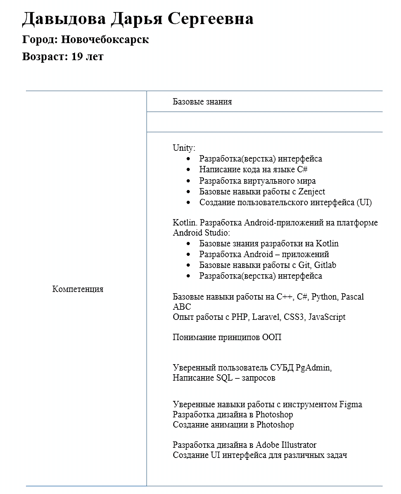
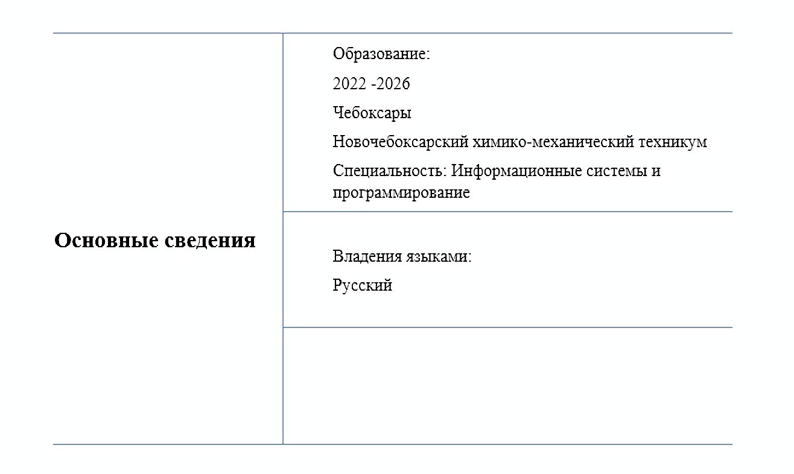

<h1 align="center">Портфолио</h1>
   <h2 align="center">Основная информация</h2>
  
  <h4 align="center">
   
    
  </h4>

  <h2> Проекты</h2>

  <h3>Дизайн</h3>
  <ul>
    <li><a href="https://github.com/lfif2006/Festival-website-design">Проект 1</a> - Создания дизайна для веб-сайта фестивалей уличной еды</li>
     Описание: Макет сайта фестивалей уличной еды в Figma, разработанный для учебной практики
  </ul>

  <h3>Геймдев</h3>
  <ul>
    <li><a href="https://github.com/lfif2006/The-game-is-a-visual-novel ">Проект 2</a> - Мобильная игра Акатуй</li>
     Описание: Образовательная игра в жанре визуальная новелла, разрабатываемая для дипломной работы
  </ul>

